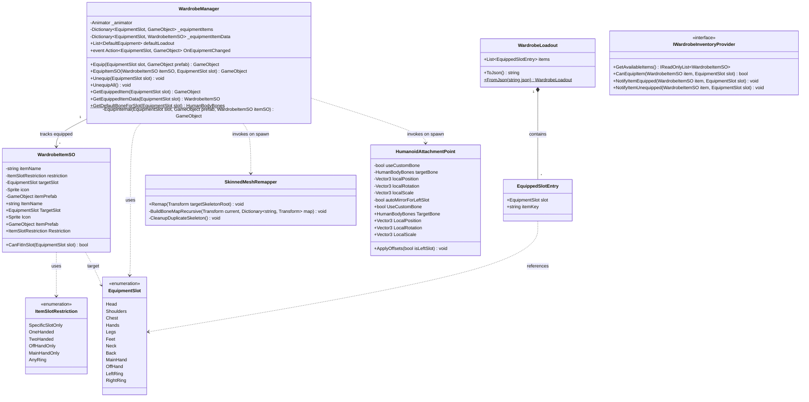
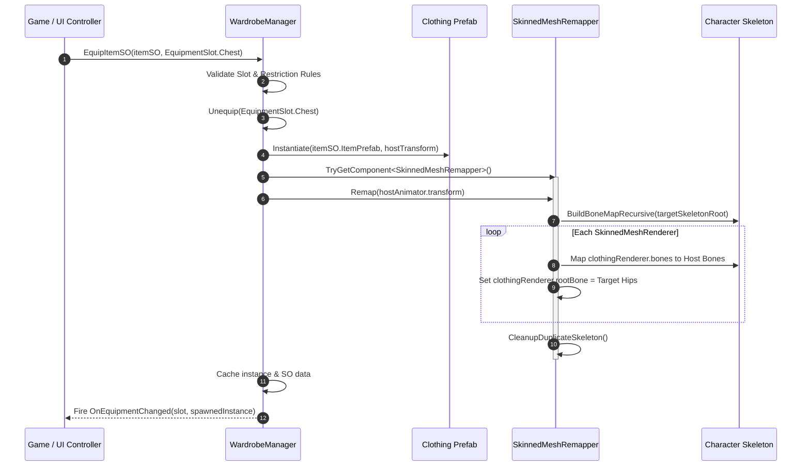
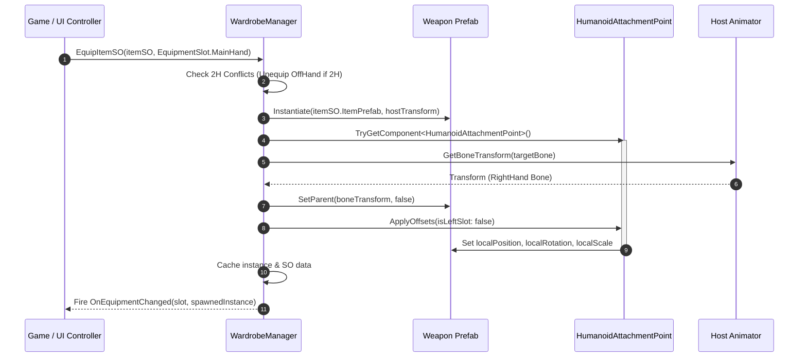
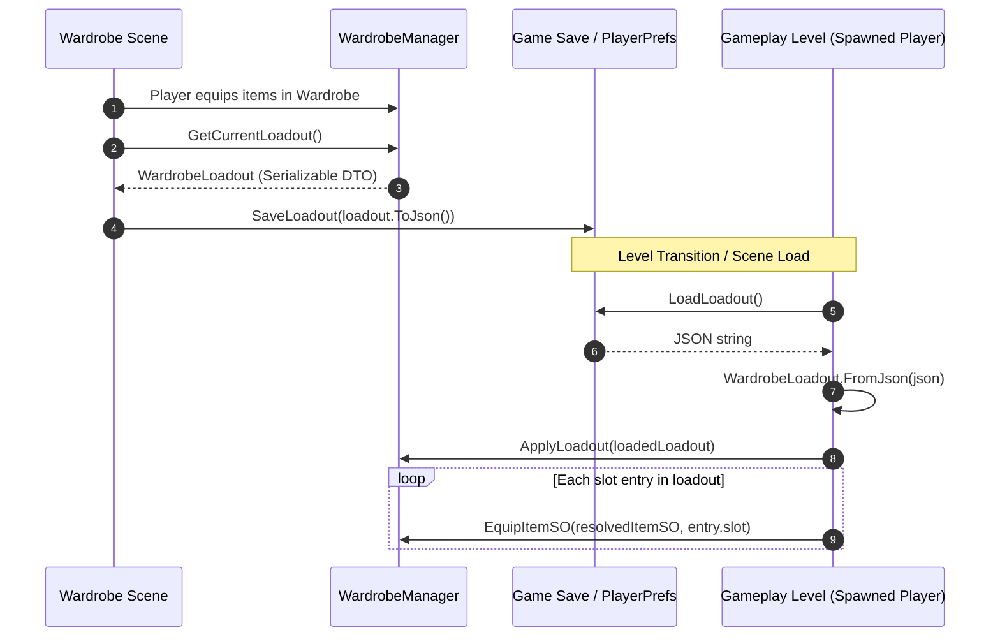

# Universal Humanoid Wardrobe — Architecture Specification

This document details the architectural foundation, design principles, class structures, UML diagrams, and integration patterns of the **Universal Humanoid Wardrobe** package.

---

## 1. System Overview and Design Goals

The primary goal of the **Universal Humanoid Wardrobe** package is to provide an extensible, decoupled, and performant character customization subsystem for Unity.

### Key Architectural Principles
1. **Engine Agnostic Decoupling**: The wardrobe core does not dictate gameplay rules, character movement, stat calculations, or inventory architecture. It acts strictly as an equipment visualization and binding manager.
2. **Standard Humanoid Rig Compliance**: Works seamlessly on any character model configured with Unity's standard `Humanoid` Avatar rig.
3. **Dual Attachment Paradigms**:
   * **Skinned Deforming Items**: Clothing and armor meshes dynamically remap their bone bindings to match the host character skeleton without duplicating skeletons.
   * **Rigid Socketed Items**: Weapons, shields, helmets, and accessories parent to designated `HumanBodyBones` sockets with configurable local offsets and auto-mirroring.
4. **State Persistence**: Supports both scene-transferable GameObject retention (`DontDestroyOnLoad`) and lightweight serialization via data transfer objects (`WardrobeLoadout`).

---

## 2. UML Class Diagram

The following diagram illustrates the core components, data structures, and their relationships:



---

## 3. Sequence Diagrams

### 3.1. Equipping a Skinned Mesh Item (Clothing / Armor)



### 3.2. Equipping a Rigid Prop Item (Weapons / Accessories)



### 3.3. Persistence Flow (Save & Restore Across Scenes)



---

## 4. Architectural Layers & Separation of Concerns

The module divides responsibilities into three distinct layers:

```
┌──────────────────────────────────────────────────────────────┐
│                        GAMEPLAY LAYER                        │
│   (Player Stats, Save System, Inventory Model, Game Rules)   │
└──────────────────────────────┬───────────────────────────────┘
                               │ Event Subscription & Loadout DTO
                               ▼
┌──────────────────────────────────────────────────────────────┐
│                    WARDROBE CORE PACKAGE                     │
│               (Neymanoff.HumanoidWardrobe)                  │
│                                                              │
│  ┌───────────────────────┐        ┌───────────────────────┐  │
│  │    WardrobeManager    │        │    WardrobeItemSO     │  │
│  │ (Runtime Controller)  │        │   (Item Data Model)   │  │
│  └───────────┬───────────┘        └───────────────────────┘  │
│              │                                               │
│       ┌──────┴──────────────┐                                │
│       ▼                     ▼                                │
│ ┌──────────────────┐  ┌───────────────────────────┐          │
│ │SkinnedMeshRemapper│  │  HumanoidAttachmentPoint  │          │
│ │(Deforming Meshes)│  │ (Socket Bone Attachments) │          │
│ └──────────────────┘  └───────────────────────────┘          │
└──────────────────────────────────────────────────────────────┘
                               ▲
                               │ UI Binding
┌──────────────────────────────┴───────────────────────────────┐
│                    OPTIONAL SAMPLES / UI                     │
│             (Neymanoff.HumanoidWardrobe.UI)                 │
│      (DemoInventoryUI, EquipmentSlotUI, Turntable)           │
└──────────────────────────────────────────────────────────────┘
```

### 4.1. Core Layer (`Neymanoff.HumanoidWardrobe`)
* Completely isolated from UI and external game systems.
* Relies only on standard Unity engine modules (`UnityEngine.CoreModule`, `UnityEngine.AnimationModule`).
* Exposes clean events (`OnEquipmentChanged`) and public methods (`EquipItemSO`, `Unequip`, `GetCurrentLoadout`).

### 4.2. UI / Sample Layer (`Neymanoff.HumanoidWardrobe.UI`)
* Provides an out-of-the-box paper-doll equipment UI and grid selector.
* Listens to `WardrobeManager` events to refresh slots dynamically.
* Can be deleted or replaced entirely without affecting core wardrobe logic.

---

## 5. Technical Considerations & Performance

### 5.1. Skinned Mesh Culling & Bounds
* Standard Unity skinned meshes calculate frustum culling based on their `rootBone` and `localBounds`.
* When clothing is remapped, `rootBone` must be bound to the skeleton's root bone (e.g. `Hips` or `spine`), **not** the character's GameObject origin.
* If a mesh causes clipping or premature culling, `SkinnedMeshRenderer.updateWhenOffscreen` or copying `localBounds` from the host body mesh guarantees stable rendering.

### 5.2. Garbage Collection & Memory Management
* `SkinnedMeshRemapper` only runs once per item instantiation.
* Transform dictionaries are allocated locally during the remap routine and discarded immediately after setup.
* Unused skeleton nodes from clothing prefabs are systematically removed (`Destroy` in Play Mode, `DestroyImmediate` in Editor Mode) to avoid hierarchy bloat and overhead during animation updates.
