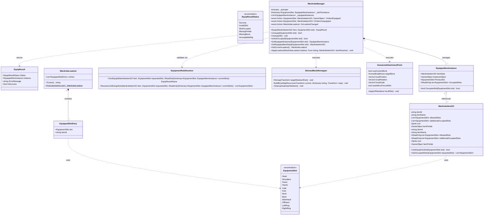
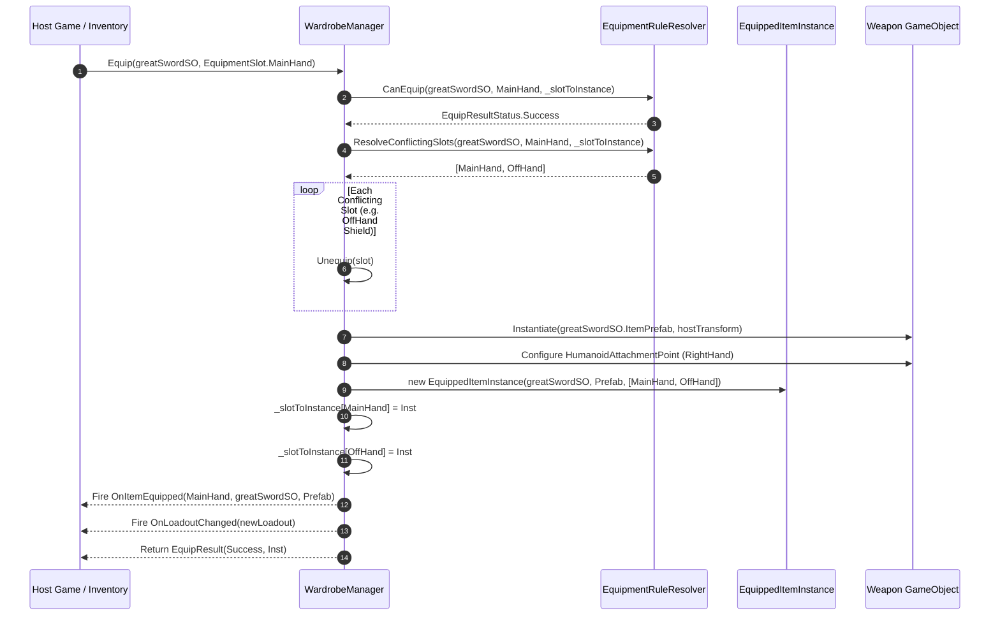
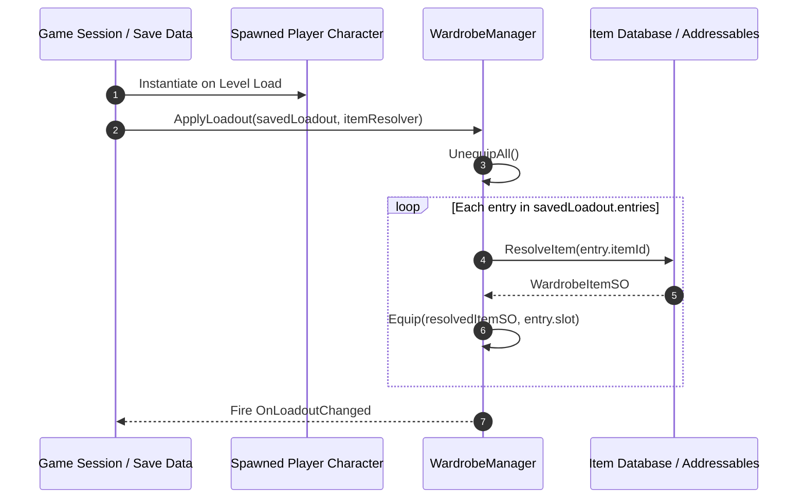

# Universal Humanoid Wardrobe — Architecture Specification

This document details the architectural foundation, design principles, class structures, UML diagrams, and integration patterns of the **Universal Humanoid Wardrobe** package.

---

## 1. Architectural Principles

### 1.1. Gameplay-Agnostic / Host-Game-Agnostic
The wardrobe module is strictly **Unity-specific** (relying on `UnityEngine`, `Animator`, `HumanBodyBones`, `SkinnedMeshRenderer`), but it is completely **Gameplay-Agnostic**:
* It does not know or care about combat calculations, weapon stats, durability, player levels, or inventory currencies.
* It does not impose an inventory architecture (grid, weight, slots, or tree-based).
* Its single responsibility is **managing visual equipment representation, bone bindings, socket transforms, and equipment occupancy state**.

### 1.2. Split Compatibility Guarantees
* **Rigid Items (Socket Attachment)**: **High Universality**. Attached directly to standard `HumanBodyBones` transforms (e.g. `RightHand`, `LeftHand`, `Head`). Functions out-of-the-box on virtually any valid Unity Humanoid avatar.
* **Skinned Items (Mesh Remapping)**: **Rig-Dependent**. Humanoid animation retargeting retargets motion, but it does *not* automatically deform meshes across wildly different bind poses, body proportions, or rest poses. Skinned clothing meshes require matching rest poses and compatible bone hierarchies (including helper/twist bones).

---

## 2. UML Class Diagram



---

## 3. Multi-Slot Occupancy Model

In standard RPG equipment models, weapons such as Greatswords or Staves are "Two-Handed": they are initiated in `MainHand`, but logically and visually occupy both `MainHand` and `OffHand`.

### How Multi-Slot Occupancy Works
1. When `GreatSword` is equipped into `MainHand`:
   * `WardrobeItemSO.AllowedSlots` = `[MainHand]`.
   * `WardrobeItemSO.AdditionalOccupiedSlots` = `[OffHand]`.
   * The resolver identifies that both `MainHand` and `OffHand` will be occupied.
   * Any item already in `OffHand` (or `MainHand`) is unequipped first.
   * A single `EquippedItemInstance` is created holding the spawned 3D weapon GameObject.
   * Both slots point to this single instance:
     ```text
     _slotToInstance[MainHand] ──► [EquippedItemInstance (GreatSword)]
     _slotToInstance[OffHand]  ──► [EquippedItemInstance (GreatSword)]
     ```
2. **Atomic Unequip**: Calling `Unequip(EquipmentSlot.OffHand)` or `Unequip(EquipmentSlot.MainHand)` removes both slot references, destroys the visual GameObject once, and fires `OnItemUnequipped` cleanly.
3. **Predictable Querying**: `IsSlotOccupied(EquipmentSlot.OffHand)` returns `true` and returns the `GreatSword` instance, preventing conflicting equipment or empty off-hand anomalies.

---

## 4. Sequence Diagrams

### 4.1. Equipping a Two-Handed Weapon (Multi-Slot Flow)



### 4.2. Runtime Persistence & Loadout Rehydration



---

## 5. Architectural Boundaries & Data Flow

```
┌─────────────────────────────────────────────────────────────┐
│                       HOST GAME LAYER                       │
│     (Game Inventory, Character Stats, Save/Load System)     │
└──────────────────────────────┬──────────────────────────────┘
                               │ Calls Equip / ApplyLoadout
                               ▼
┌─────────────────────────────────────────────────────────────┐
│                    WARDROBE CORE PACKAGE                    │
│                                                             │
│   ┌────────────────────────┐     ┌──────────────────────┐   │
│   │ EquipmentRuleResolver  │◄────┤   WardrobeItemSO     │   │
│   │  (Conflict & Slots)    │     │   (Stable ItemId)    │   │
│   └───────────┬────────────┘     └──────────────────────┘   │
│               │                                             │
│               ▼                                             │
│   ┌────────────────────────┐     ┌──────────────────────┐   │
│   │    WardrobeManager     │────►│ EquippedItemInstance │   │
│   │ (Visual & State Mgmt)  │     │(Multi-slot reference)│   │
│   └───────────┬────────────┘     └──────────────────────┘   │
│               │                                             │
│       ┌───────┴──────────────┐                              │
│       ▼                      ▼                              │
│ ┌──────────────────┐   ┌───────────────────────────┐        │
│ │SkinnedMeshRemapper│  │  HumanoidAttachmentPoint  │        │
│ │ (Remap to Hips)  │   │   (Bone socket offsets)   │        │
│ └──────────────────┘   └───────────────────────────┘        │
└─────────────────────────────────────────────────────────────┘
                               │ Outward Events Only
                               ▼
               OnItemEquipped / OnItemUnequipped
                       OnLoadoutChanged
```

### Outward-Only Notification
* The Wardrobe Core **never calls into the host game's inventory**.
* The host game controls the wardrobe by calling `Equip` / `Unequip`.
* The wardrobe communicates changes outward exclusively via events:
  * `OnItemEquipped(EquipmentSlot primarySlot, WardrobeItemSO item, GameObject instance)`
  * `OnItemUnequipped(EquipmentSlot primarySlot, WardrobeItemSO item)`
  * `OnLoadoutChanged(WardrobeLoadout currentLoadout)`

---

## 6. Future Expansion Points (Roadmap Alignment)

1. **`WardrobeRigProfile`**: ScriptableObject mapping per-rig socket offsets (e.g. Orc vs Dwarf vs Elf), custom bone aliases, and bounds presets.
2. **Body Coverage & Mesh Clipping (`HideBodyParts`)**: Declarative flags on `WardrobeItemSO` (e.g. `HideTorso`, `HideLegs`) to toggle sub-mesh visibility or swap body geometry to prevent skin poke-through.
3. **Rig Remap Profile**: Explicit bone-to-bone alias mapping to handle non-standard twist/helper bones across different modeling DCCs.
